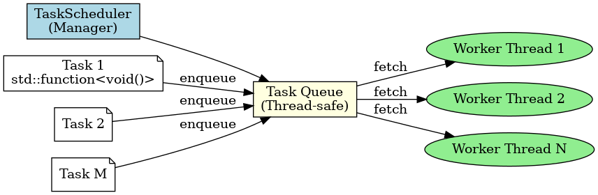

# 🧠 Lightweight M:N Task Scheduler in C++

This project implements a lightweight M:N task scheduler in modern C++, inspired by the Goroutine scheduler in Go. The goal is to efficiently map **M logical tasks** onto **N OS threads (cores)**, achieving concurrency without the overhead of spawning a thread per task.

---

## 🚩 Problem

Operating system threads are expensive. Launching hundreds or thousands of them just to execute lightweight tasks can overwhelm the system. Languages like Go solve this via *goroutines* — light threads multiplexed over a pool of OS threads using a scheduler.

C++ lacks a native goroutine-like abstraction. This project builds a **cooperative, thread-pool-backed scheduler** to mimic Go's M:N task scheduling behavior.

---

## ⚙️ Solution

- Tasks are `std::function<void()>` units submitted to the `TaskScheduler`.
- The scheduler uses `N` worker threads (typically `std::thread::hardware_concurrency()`).
- Tasks are pushed into a **thread-safe shared queue**.
- Workers fetch and execute tasks until the queue is empty.
- Includes synchronization via `std::mutex` and `std::condition_variable`.

---

## 🧩 Architecture



- 🟦 `TaskScheduler`: Manages the lifecycle of worker threads and queues.
- 🟨 `Task Queue`: Thread-safe queue where tasks are enqueued and consumed.
- 🟩 `Worker Threads`: Consume tasks and execute them concurrently.
- 🗒️ `Tasks`: Lightweight `std::function<void()>` operations.

---

## 🚀 Getting Started

### Prerequisites

- C++17 or later
- CMake (optional for building)
- Linux, macOS, or Windows

### Build and Run

```bash
g++ -std=c++17 -pthread -o scheduler main.cpp scheduler.cpp
./scheduler

